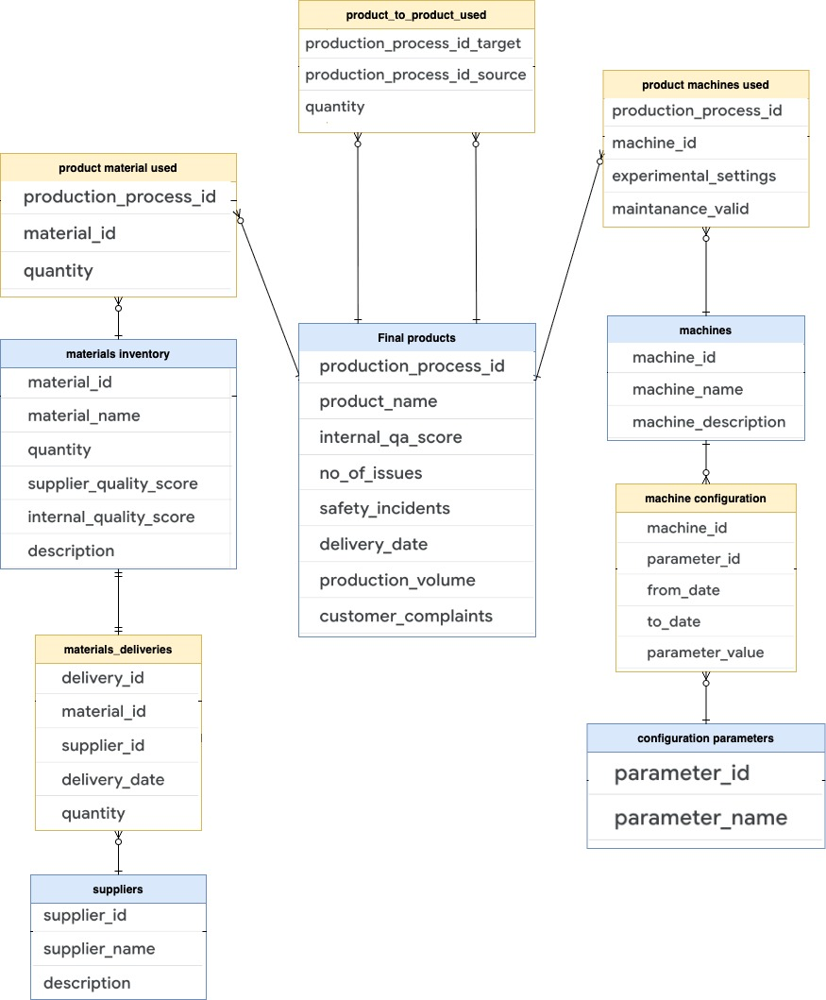

# BigQuery Graph demo
This is end to end set of codes to demo the BigQuery Graph.

This BigQuery Graph demo operates on below presented and populated with precooked data schema.
It simulates the manufacturing production process of `final_products` including:
- suppliers providing materials used to produce final product:
  - `suppliers`
  - `material_deliveries`
  - `materials_inventory`
  - `product_materials_used`
- machines used in production process of final products:
  - `machines`
  - `product_machines_used`
- products becoming input ingredients used to produce final product
  - `product_to_product_used`

---

## Scenario
Use BigQuery Graph to investigate if there is any dependency between faulty products `final_products.customer_complaints = true` and factors like `product_machines_used.experimental_settings = true` or some suppliers.

Machine configuration data is not used for this investigation.

## How to use it
1. Prerequisite is to get BigQuery Graph enabled on the project.
2. Codes are operating on SCHEMA `project_ID`.`demo_dataset`, so make sure to replace those with own values, before running the codes.
3. Run the [1. Data DDL.sql](1.%20Data%20DDL.sql) to create schema and tables.
4. Run the [2. Load data.sql](2.%20Load%20data.sql) to populate schema with precooked data.
5. Run the [3. Graph definition.sql](3.%20Graph%20definition.sql) to populate schema with precooked data.
6. In Colab Enterprise open the [BigQuery_Graph_demo](BigQuery_Graph_demo.ipynb) notebook and run the code cells to play with the Graph.
